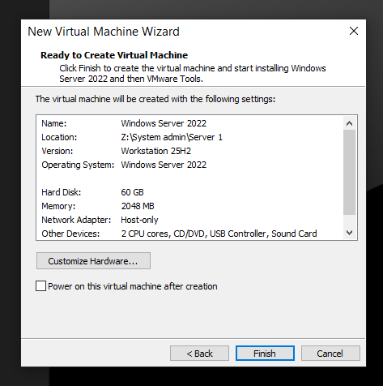

# 1. Environment Setup

## Objective

Prepare the lab environment by creating a Windows Server 2022 virtual machine, installing Active Directory Domain Services (AD DS), and configuring the initial Active Directory structure.

---

## Step 1 - Create the VMware Virtual Machine

Create a Windows Server 2022 virtual machine that will serve as the Domain Controller for the lab.

### Screenshot

---

## Step 2 - Install Active Directory Domain Services

Install the **Active Directory Domain Services (AD DS)** role and promote the server to a Domain Controller for the **mazen.local** domain.

### Tasks

- Change computer name.
- Put static IP for the server.
- Install the AD DS role.
- Promote the server to a Domain Controller.
- Create the **mazen.local** forest.

### Screenshot

---

## Step 3 - Create Organizational Units, Users, and Groups

Create the basic Active Directory structure required for the lab.

### Tasks

- Create Organizational Units (OUs).
- Create domain users.
- Create security groups.

### Screenshot

---

## Step 4 - Automate Active Directory Management with PowerShell

Use PowerShell to automate the creation of Active Directory groups and assign users.

### Tasks

- Create security groups.
- Add users to groups.
- Verify the created objects.

### Screenshot

---

## Step 5 - Configure User Account Properties

Modify user account settings for better administration.

### Tasks

- Change the user's display name.
- Configure allowed logon hours.
- Verify the applied settings.

### Screenshot

---

## Summary

In this section, the lab environment was successfully prepared by:

- Creating the VMware virtual machine.
- Installing Windows Server 2022.
- Deploying Active Directory Domain Services.
- Creating Organizational Units (OUs).
- Creating users and security groups.
- Automating Active Directory management using PowerShell.
- Configuring user account properties.

The environment is now ready for configuring DNS, DHCP, File Server, Group Policy, and additional enterprise services.
