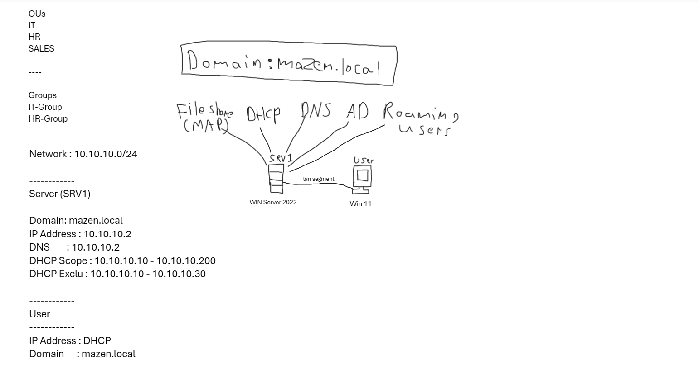

# Windows Server 2022 Active Directory Home Lab

A hands-on Windows Server 2022 Home Lab that demonstrates the deployment and administration of an enterprise Active Directory environment.

The lab covers Active Directory Domain Services (AD DS), DNS, DHCP, File Sharing, Roaming Profiles, Drive Mapping, PowerShell automation, and Windows administration best practices.

---

## Lab Topology



---

## Technologies Used

- Windows Server 2022
- Windows 11
- VMware Workstation
- Active Directory Domain Services (AD DS)
- DNS
- DHCP
- SMB File Sharing
- NTFS Permissions
- PowerShell
- Group Policy

---

## Lab Modules

| Module | Description |
|---------|-------------|
| **01. Environment Setup** | Deploy Windows Server 2022, install AD DS, create the domain, OUs, users, and groups. |
| **02. DNS Configuration** | Configure DNS zones, records, and verify name resolution. |
| **03. DHCP Configuration** | Deploy DHCP, create scopes, and configure client IP assignment. |
| **04. File Server** | Configure shared folders, NTFS permissions, and Access-Based Enumeration. |
| **05. Roaming Profiles** | Configure roaming profiles for domain users. |
| **06. Drive Mapping** | Map shared folders using Active Directory. |
| **07. Testing & Validation** | Verify DNS, DHCP, domain connectivity, and user access. |

---

## Documentation

- 📄 [01 - Environment Setup](01-Environment-Setup.md)
- 📄 02 - DNS Configuration *(Coming Soon)*
- 📄 03 - DHCP Configuration *(Coming Soon)*
- 📄 04 - File Server *(Coming Soon)*
- 📄 05 - Roaming Profiles *(Coming Soon)*
- 📄 06 - Drive Mapping *(Coming Soon)*
- 📄 07 - Testing & Validation *(Coming Soon)*

---

## Skills Demonstrated

- Active Directory Administration
- Windows Server Administration
- DNS Configuration
- DHCP Deployment
- User & Group Management
- Organizational Unit (OU) Design
- PowerShell Automation
- File Server Management
- NTFS Permissions
- Access-Based Enumeration
- Roaming Profiles
- Drive Mapping
- Domain Administration

---

## Project Structure

```text
WIN-SRV-Homelab
│
├── README.md
├── 01-Environment-Setup.md
├── 02-DNS-Configuration.md
├── 03-DHCP-Configuration.md
├── 04-File-Server.md
├── 05-Roaming-Profiles.md
├── 06-Drive-Mapping.md
├── 07-Testing.md
└── images/
```

---


## Author

**Mazen Medhat**

- IT Student
- Cybersecurity Enthusiast

If you found this project useful, feel free to ⭐ star the repository.
